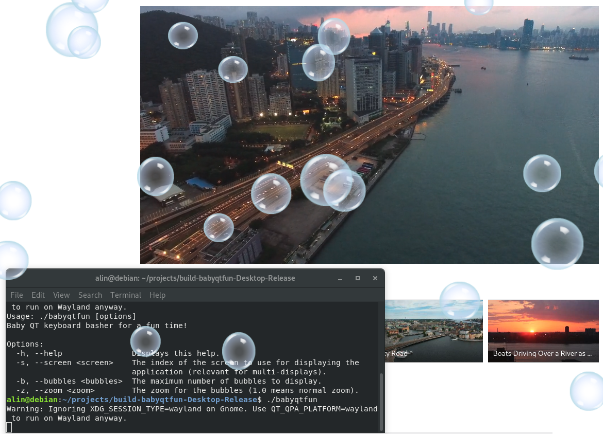

# babyqtfun

## Baby QT Fun

`babyqtfun` is a keyboard smasher for babies.

It creates a **transparent**, **always on top**, **fullscreen** window on the selected screen, thus catching the keyboard and mouse input. \
Whenever a key is pressed the program will randomly create a bubble on top of the desktop.

## Usage

```console
Baby QT keyboard basher for a fun time!

Options:
  -h, --help               Displays this help.
  -s, --screen <screen>    The index of the screen to use for displaying the
                           application (relevant for multi-displays).
  -b, --bubbles <bubbles>  The maximum number of bubbles to display.
  -z, --zoom <zoom>        The zoom for the bubbles (1.0 means normal zoom).
```



## Technical issues

The program was developed in Qt + Qml on a Debian buster OS with the help of QtCreator.

## License

The code is licensed under the [GPLv3](https://www.gnu.org/licenses/gpl-3.0.en.html) license.

The code uses sprites from the [maroon](http://doc.qt.io/qt-5/qtquick-demos-maroon-example.html) example.
